# Creative Mail User Guide

Installation and setup is a very straightforward process and only takes around 10 minutes,

1. The first step is to install the Creative Mail app from the appexchange - [https://appexchange.salesforce.com/listingDetail?listingId=a0N3u00000RMeiuEAD](https://appexchange.salesforce.com/listingDetail?listingId=a0N3u00000RMeiuEAD)

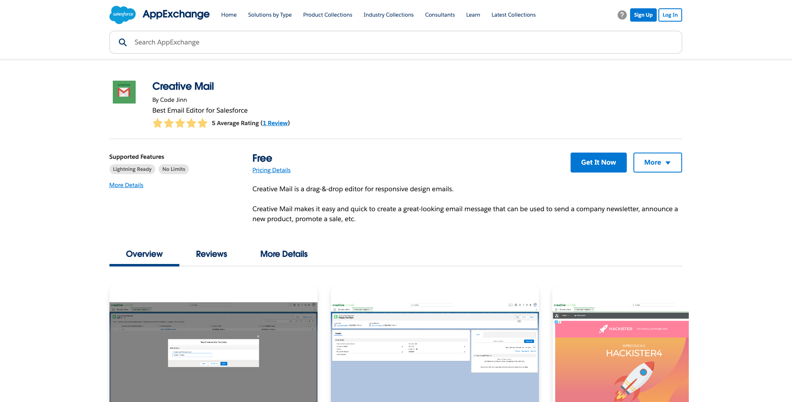

2. Follow the steps to install the app in your Sandbox or Production environment

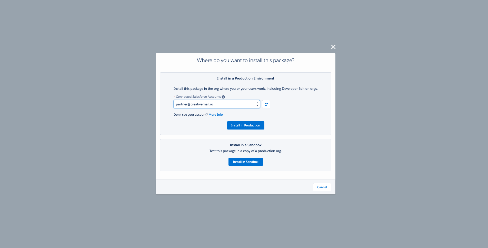

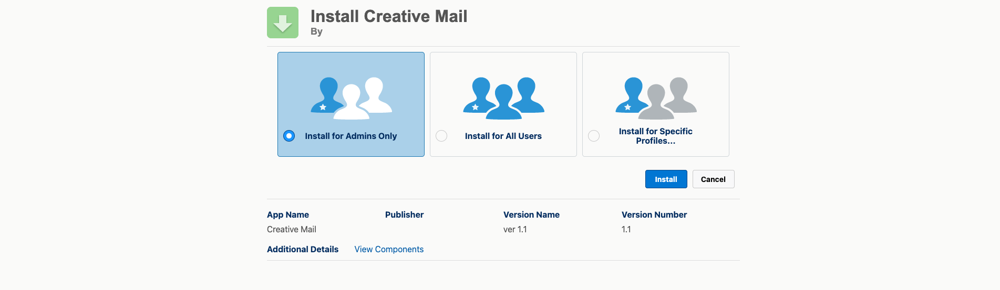

3. Once installation is complete, you need to ensure that you have assigned your user(s) with the Permission set - **Creative Mail User**

4. Next step is to go the Creative Mail app by searching for the app from the **App Launcher**and navigate to the Creative Mail Templates tab

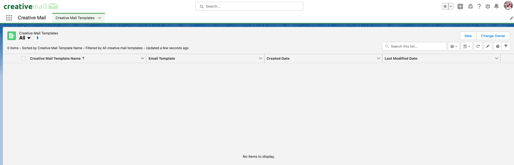

5. You're all set, now just hit the **New** button and give your first Creative Mail Template a name

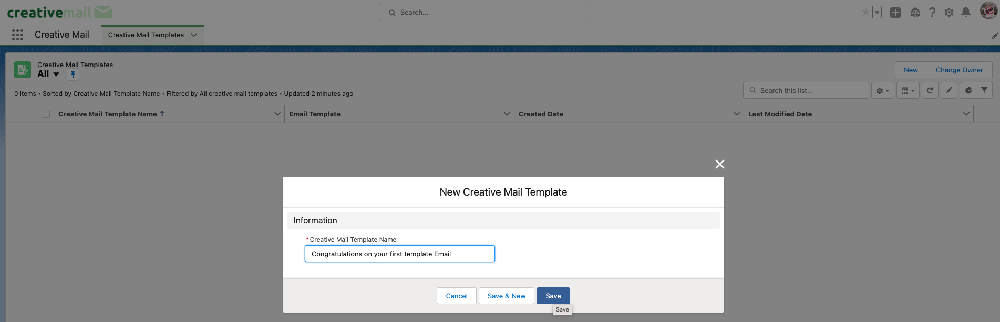

**NOTE**: Special characters are not allowed for the name

6. Once you navigate to the Creative Mail Template record page, you can update basic template details by clicking on the **pencil icon**

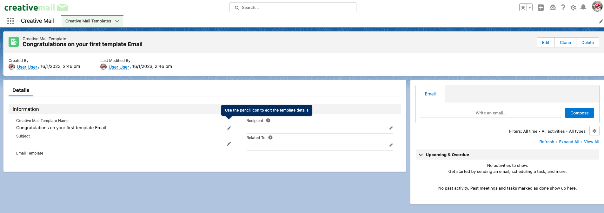

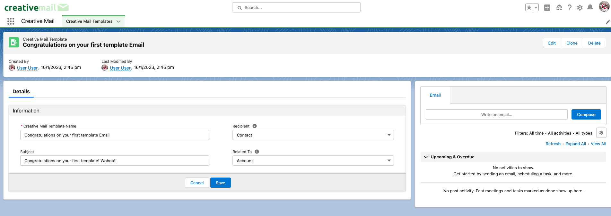

7. To access the Email Template builder, simply click the **Edit** button on the top right

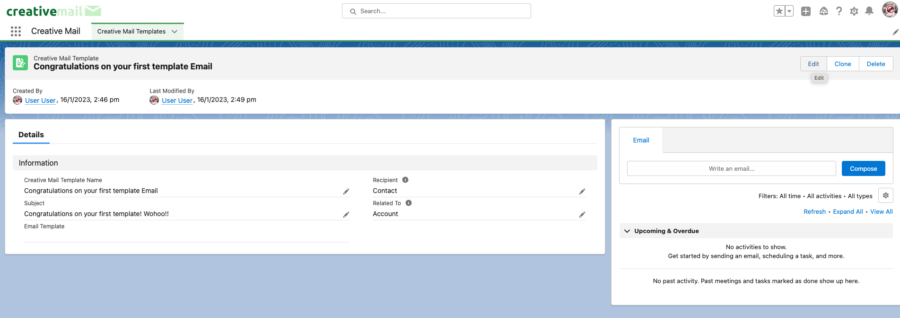

<figure>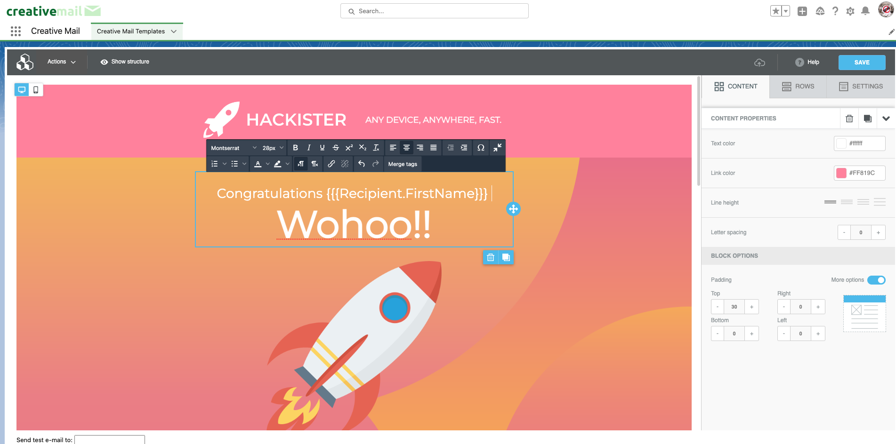<figcaption></figcaption></figure>

**NOTE**: Merge tags can be accessed via the Text editor

8. Once you're done oozing all your creativity on your perfect email design, you can hit **Save** and view the Email Template that you have created.

The link to the Lightning Email Template will also be displayed on the record page.

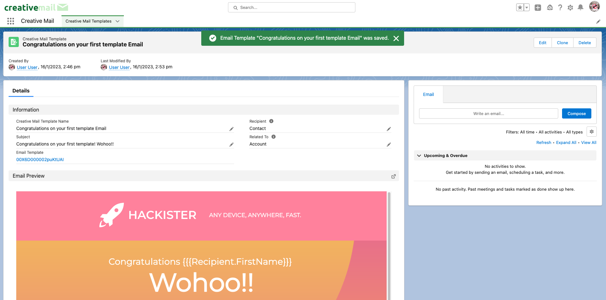

9. You can do a quick send by using the **Compose** button available on the right side

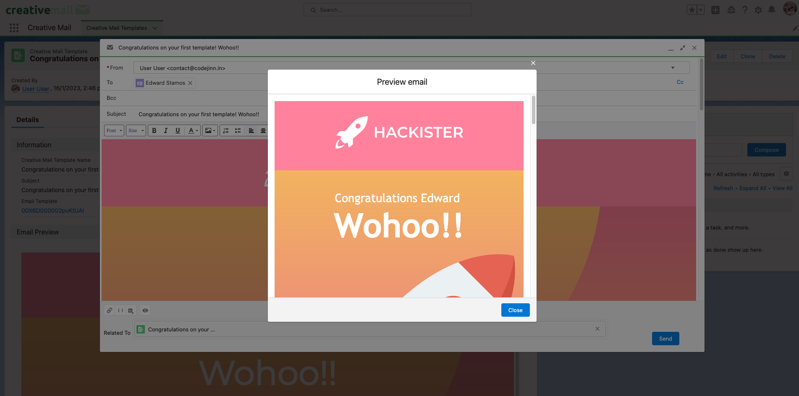\
**NOTE**: You need to click on **Insert, Create or Update a template** button to select the Email Template

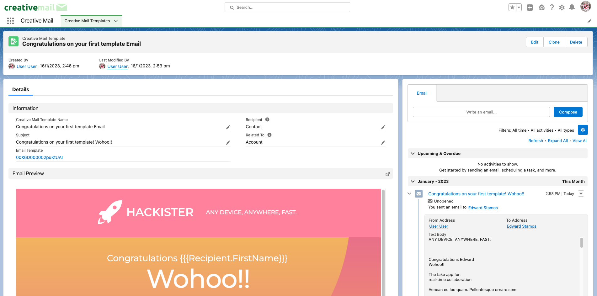\
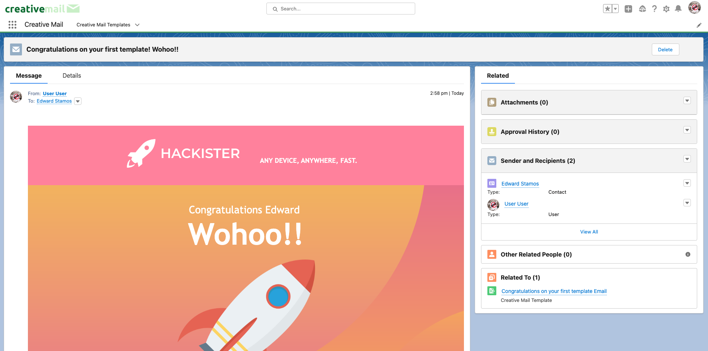

10. And that's it, you've just designed and sent your first email using Creative Mail!
